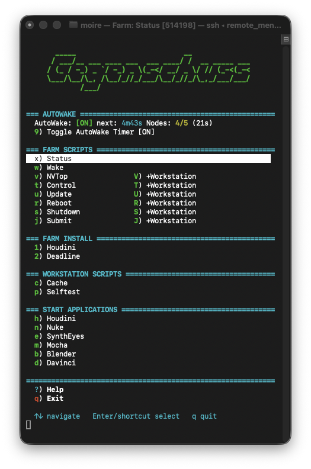
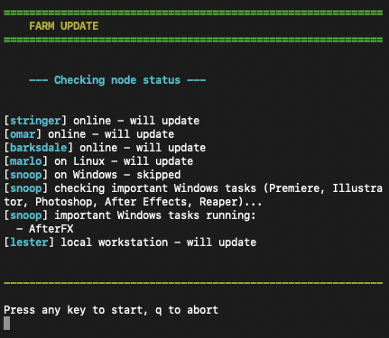
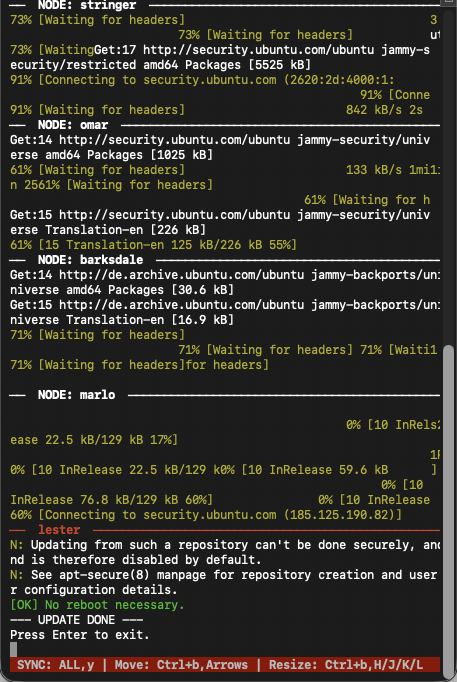
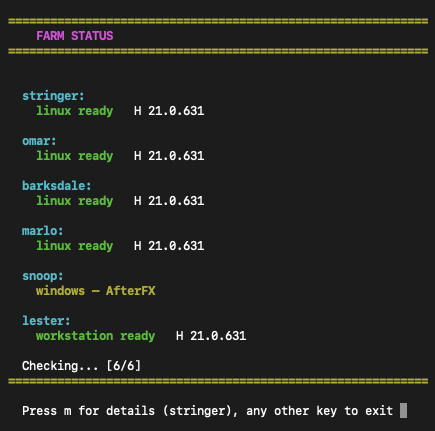
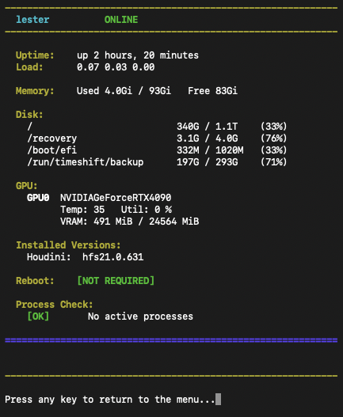
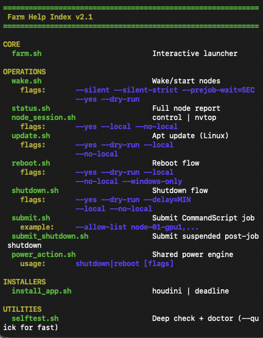

```
       _____                          __
      / ___/__ ___ ____ ___  ___ ____/ /  __ _____ ___
     / (_ / -_) _ `/ -_) _ \(_-</ __/ _ \/ // (_-<(_-<
     \___/\__/\_, /\__/_//_/___/\__/_//_/\_,_/___/___/
             /___/
```

# Farm

Your GPU workstations sit idle every night. This turns them into a Linux
render farm -- even with no Linux background. A guided install script
provisions each node end-to-end, day-to-day maintenance runs from an
interactive menu, and if you ever get stuck a friendly AI assistant can
hand you the exact commands to run. You don't have to build any of this
from scratch; this is the framework to make it easy.

One interactive menu to wake machines, submit renders, monitor GPUs, deploy
software, and shut everything down -- across Linux-only render nodes and
Windows/Linux dual-boot workstations. Built for
[Deadline 10](https://www.awsthinkbox.com/deadline) with
[Houdini](https://www.sidefx.com/) -- but the main panel is plain shell
and easy to customise for your own pipeline.

The main panel lives on the **artist workstation** and doubles as a
**custom quick-launch panel**: bind `Gegenschuss_farm_control.sh` to a
global keyboard shortcut and every farm function -- plus every DCC app
(Houdini, Nuke, Blender, SynthEyes, Mocha, DaVinci) -- is one key-press
away, each opening in its own terminal window with verbose logs so you
can see exactly what's happening. Terminal commands are only needed for
Deadline automation; everything else runs from the menu via single-key
prompts.

**Make it yours.** Drop in your own ASCII logo and colour scheme by
editing [`scripts/lib/header.sh`](scripts/lib/header.sh) -- the animated
header on startup is just a shell function and takes any figlet-style
art.



### Is this for me?

This is for small-to-mid studios (2-20 machines) running Deadline 10 on Linux,
optionally with Windows dual-boot workstations. If you use a cloud render
service or don't run Deadline, this isn't for you.

### What it replaces

| Manual workflow | With Farm |
|-----------------|-----------|
| Walk to each machine and power it on | `wake.sh` -- WoL + dual-boot reboot, all nodes at once |
| RDP into Windows to check if someone's working | Auto-detects active artist sessions, skips busy machines |
| SSH into each node to install software | `install_app.sh` -- deploys to all nodes simultaneously |
| Forget to shut down after overnight renders | Post-job shutdown triggers automatically via Deadline |
| Deadline Pulse fails silently | Shell scripts you can read, debug, and trust |
| VPN appliance to reach the farm remotely | Tailscale -- wake the farm from your laptop anywhere |

---

## Why This Exists

At [Gegenschuss](https://gegenschuss.com) our artists work on
Windows, macOS, and Linux. The GPU workstations dual-boot Windows and
Linux -- artists use them during the day, renders run overnight. Dedicated
rack-mount nodes run Linux full-time.

We built this because:

- **Deadline Pulse was unreliable.** Power management through Deadline's
  built-in tools kept failing silently -- machines wouldn't wake, wouldn't
  shut down, or would get stuck in limbo. We needed something we could
  actually debug and trust.

- **Full control over power states.** Wake-on-LAN, dual-boot reboot from
  Windows to Linux via UEFI boot entries, safe shutdown with checks for
  running applications -- all orchestrated from shell scripts we can read
  and fix when something breaks.

- **Tailscale changed everything.** With Tailscale VPN, the farm is
  reachable from anywhere. The macOS remote menu lets you wake the entire
  farm, mount shares, and SSH into the workstation from a laptop on the
  couch. No port forwarding, no VPN appliances.

- **Simultaneous updates and installs.** Tmux sessions across all nodes
  let you run `apt upgrade` or deploy a new Houdini build on every machine
  at once. No need to clone disk images -- each node is provisioned from
  scratch with a single setup script that handles different hardware
  configurations.

 

- **Mixed hardware, one config.** Some machines are proper render nodes
  (headless, Linux-only), others are artist workstations (dual-boot,
  Windows primary). The node definition system handles both. Dedicated
  nodes wake and render; dual-boot nodes check for active Windows sessions
  before rebooting, so the farm never interferes with an artist's work.

 

- **Adding new machines is easy.** Install the OS, run the setup script,
  add one line to the node definitions. The script handles NVIDIA drivers,
  Deadline workers, network mounts, Wake-on-LAN, TTY1 dashboard --
  everything a render node needs.

**Supported platforms:**
- Render nodes: Ubuntu 22.04 / 24.04, Rocky Linux 9 / 10
- Control workstation: Linux or macOS
- Remote client: macOS (Tailscale VPN)

---

## Power Management

Deadline Pulse's built-in power management never worked reliably for us,
so the farm ships with its own wake/shutdown scripts that slot into any
Deadline workflow.

### Auto-Wake (dual-boot utilization)

The whole point is to put idle hardware to work at night. Dual-boot
workstations **always default to Windows on startup** -- that's what
artists want in the morning, and it means nobody has to touch BIOS
settings to pick an OS manually. The farm scripts handle the switching:

- A user-level `systemd` timer sends a Wake-on-LAN packet **every 10
  minutes**.
- Powered-down dual-boot machines wake up and boot straight into
  **Linux** via a one-time UEFI boot-entry override, render overnight,
  and fall back to the Windows default on the next cold boot -- no
  permanent BIOS change, no artist intervention required.
- Machines that are already on, or that have an active artist session on
  Windows, are left alone.
- Toggle the whole thing on/off with one key-press from the farm menu
  (`9` -- Toggle AutoWake Timer), or manage it manually via
  `scripts/deadline/autowake.sh {install|enable|run-now|disable|uninstall}`.

### Deadline-chained wake & shutdown

Instead of relying on Pulse, wake and shutdown are plain scripts you chain
into your Deadline jobs:

- **Pre-job wake** -- point Deadline's Pre-Job Script to
  `scripts/core/wake.sh --silent` (or the `prejob_wake.py` wrapper).
  Every render job wakes its required nodes before the first frame is
  picked up.
- **Post-job shutdown** -- submit a suspended shutdown job with
  `scripts/deadline/submit_shutdown.sh` and make it dependent on your
  render batch. When the batch finishes, the farm powers itself down.
- **Batch finalizer** -- `scripts/deadline/finalize.sh` submits one
  dependent shutdown that waits for "all jobs in batch", so you can fire
  off many jobs and still get a single clean shutdown at the end.

Because these are shell scripts, you can read them, debug them, and
trust them in a way that Pulse never allowed.

---

## Quick Start

```bash
# 1. Copy the secrets template and fill in your values
cp config/secrets.example.sh config/secrets.sh

# 2. Launch the interactive farm menu
./Gegenschuss_farm_control.sh
```

Just want to look around first?

```bash
scripts/core/wake.sh --help
scripts/core/status.sh --help
scripts/core/shutdown.sh --help
```

Every script supports `--help` for usage details and `--dry-run` where applicable.

---

## Configuration

All user-specific values (node MACs, IPs, passwords, mount paths) live in
secrets files that are excluded from version control.

**Three secrets files to set up:**

```bash
# Farm-wide config (nodes, paths, credentials)
cp config/secrets.example.sh config/secrets.sh

# macOS remote menu (Tailscale IPs, share names)
cp remote_menu/config/secrets.example.sh remote_menu/config/secrets.sh
```

### Node Definitions

Nodes are defined in `config/secrets.sh` as a single array:

```bash
FARM_NODE_DEFS=(
    # Linux-only:  NAME|MAC|||
    "render-01|AA:BB:CC:DD:EE:01|||"
    "render-02|AA:BB:CC:DD:EE:02|||"

    # Dual-boot:   NAME|MAC|BIOS_GUID|LINUX_WAIT|WIN_USER
    "render-03|AA:BB:CC:DD:EE:03|{guid-here}|60|winuser"
)
```

| Field | Description |
|-------|-------------|
| `NAME` | SSH host prefix. Linux host = `NAME`, Windows host = `NAME-win` |
| `MAC` | Wake-on-LAN address (colon or dash format, auto-normalized) |
| `BIOS_GUID` | Windows firmware entry for Linux boot (dual-boot only) |
| `LINUX_WAIT` | Seconds to wait before Linux ping checks (default: 60) |
| `WIN_USER` | Windows username for safety prompts on dual-boot machines |

---

## Setting Up a New Render Node

### Linux Setup

The setup script provisions a fresh Ubuntu or Rocky Linux machine with
NVIDIA drivers, Houdini, Deadline 10 workers, Wake-on-LAN, autofs CIFS mounts,
Tailscale VPN, and a TTY1 status dashboard.

**Prerequisites on the new machine:**
- Clean OS install with a user account
- Wired network connectivity (DHCP)
- SSH server running

**Steps:**

```bash
# 1. Edit config/secrets.sh -- set the SETUP_* variables:
#    SETUP_NODE_NAME, SETUP_NODE_IP, SETUP_NAS_IP, SETUP_DEADLINE_IP,
#    SETUP_STUDIO_USER/PASS, SETUP_DEADLINE_PASS, SETUP_WORKSTATION_USER/PASS,
#    SETUP_WORKSTATION_HOST, SETUP_AUTOFS_MAP_NAME,
#    SETUP_SEARCH_DIR_HOUDINI, SETUP_SEARCH_DIR_DEADLINE

# 2. Copy this project to the new node
scp -r /path/to/farm user@node-ip:~/farm

# 3. SSH in and run the setup
ssh user@node-ip
cd ~/farm && sudo bash scripts/tools/setup_new_node.sh

# 4. After setup: connect Tailscale and license Houdini
sudo tailscale up
sudo /usr/lib/sesi/sesictrl login
sudo /usr/lib/sesi/sesictrl redeem
```

The script is **idempotent** -- progress is tracked in `/var/tmp/render-node-setup.state`.
Safe to re-run after errors or reboots. Delete the state file to force a full re-run.

#### What the setup script installs

- System packages (cifs-utils, autofs, nvtop, htop, build-essential, etc.)
- Tailscale VPN client
- NVIDIA GPU drivers (PPA on Ubuntu, CUDA repo on Rocky)
- Wake-on-LAN systemd service
- Autofs CIFS mounts for studio shares, Deadline repository, and workstation
- Houdini (from tarball on network share)
- Deadline 10 client + launcher + 2 GPU workers as systemd services
- TTY1 auto-login with status dashboard (or nvtop for dual-boot machines)
- SSH welcome screen with GPU stats and service status
- Console font and GRUB resolution configuration
- SELinux/firewalld disabled on Rocky (render node LAN assumption)
- Hardware-proof ethernet config (netplan/NetworkManager wildcard match)
- Cloud-init removal

### Windows SSH Setup (Dual-Boot Nodes)

Dual-boot machines run Windows during the day for artist work and reboot
into Linux at night for rendering. The farm scripts communicate with
Windows via OpenSSH to check for active sessions and trigger reboots.

#### 1. Enable OpenSSH Server on Windows

Open PowerShell as Administrator:

```powershell
$cap = Get-WindowsCapability -Online | Where-Object Name -like "OpenSSH.Server*"
Add-WindowsCapability -Online -Name $cap.Name
Start-Service sshd
Set-Service -Name sshd -StartupType Automatic
```

#### 2. Add Your Public Key

```powershell
Add-Content -Path "$HOME\.ssh\authorized_keys" -Value "ssh-ed25519 AAAA... user@workstation"
```

Fix permissions on the admin authorized_keys file:

```powershell
icacls "C:\ProgramData\ssh\administrators_authorized_keys" /inheritance:r /grant "*S-1-5-18:F" /grant "*S-1-5-32-544:F"
```

Verify both key files are present:

```powershell
type "C:\ProgramData\ssh\administrators_authorized_keys"
```

#### 3. Get the Linux Boot GUID

This GUID identifies the Linux partition in the UEFI firmware so the farm
scripts can set it as a one-time boot target.

```powershell
bcdedit /enum firmware /v
```

Look for the Linux/Ubuntu entry and copy its identifier (e.g.
`{c2bd6e3a-fdb5-11f0-a2ce-806e6f6e6963}`).

Test a one-time reboot to Linux (does not persist after boot):

```powershell
bcdedit /set "{fwbootmgr}" bootsequence "{your-guid-here}"
shutdown /r /t 0
```

#### 4. Configure the Workstation

Add the node to `/etc/hosts` (or use Tailscale DNS):

```
192.168.178.xx    newnode-win
192.168.178.xx    newnode
```

Add SSH config entries in `~/.ssh/config`:

```
Host newnode-win
    HostName 192.168.178.xx
    User admin
    StrictHostKeyChecking no
    UserKnownHostsFile /dev/null

Host newnode
    HostName 192.168.178.xx
    User newnode
    StrictHostKeyChecking no
    UserKnownHostsFile /dev/null
```

Test the connection:

```bash
ssh newnode-win "echo ok"
```

#### 5. Add to Farm Config

Add the node to `FARM_NODE_DEFS` in `config/secrets.sh`:

```bash
"newnode|AA:BB:CC:DD:EE:FF|{your-linux-guid}|60|winuser"
```

The wake script will now:
1. Send a Wake-on-LAN packet
2. Check if Windows or Linux is running via SSH
3. If Windows is idle (no artist applications open), set the Linux GUID as
   boot target and reboot
4. If an artist is working, skip the node

---

## Adding a GPU Worker to an Existing Node

```bash
# 1. Register the worker IP override
sudo nano /opt/Thinkbox/Deadline10/bin/set_worker_ip.sh
# Add:
deadlinecommand -SetSlaveSetting <node>-gpu3 SlaveHostMachineIPAddressOverride <NODE_IP>

# 2. Enable and start the worker service
sudo systemctl enable --now deadline-worker@gpu3
```

---

## Project Structure

```
Gegenschuss_farm_control.sh              Interactive farm menu (the only script at root)

config/
    secrets.sh                      Your local secrets (gitignored)
    secrets.example.sh              Template -- copy and fill in your values

scripts/
    lib/                            Shared libraries and UI
        config.sh                       Node definitions, SSH helpers, tmux, colors
        header.sh                       Animated ASCII logo
        help.sh                         One-page command reference
        wake_lib.sh                     Wake-on-LAN and dual-boot helpers
        install_lib.sh                  Application install state checking

    core/                           Node operations
        wake.sh                         Wake nodes, handle dual-boot to Linux
        status.sh                       Full node status report
        node_session.sh                 Open tmux control or nvtop panes
        update.sh                       Apt update/upgrade on all nodes
        power_action.sh                 Shared shutdown/reboot engine
        shutdown.sh                     Shutdown wrapper
        reboot.sh                       Reboot wrapper

    deadline/                       Deadline job submission
        submit.sh                       Submit generic CommandScript jobs
        submit_shutdown.sh              Submit suspended post-job shutdown
        finalize.sh                     Batch finalizer (dependent shutdown job)
        autowake.sh                     Manage systemd auto-wake timer
        examples.txt                    Deadline Monitor command-line examples

    tools/                          Utilities and launchers
        install_app.sh                  Deploy software to farm nodes
        doctor.sh                       Dependency and connectivity checker
        selftest.sh                     Regression smoke test suite
        debug.sh                        Check Windows update activity on dual-boot
        launch_houdini.sh               Launch latest Houdini from /opt
        launch_nuke.sh                  Launch latest Nuke
        setup_new_node.sh               Provision a fresh machine as render node

remote_menu/                        macOS remote menu (Tailscale VPN client)
    remote_menu.sh                      Interactive launcher
    core/
        wake.sh                         Wake nodes + mount shares + connect
        ping.sh                         Ping all nodes via Tailscale
        shutdown.sh                     Shutdown farm via SSH
        unmount.sh                      Unmount SMB shares + close Deadline Monitor
    lib/
        logo.sh                         Animated logo module
    config/
        secrets.sh                      Remote menu secrets (gitignored)
        secrets.example.sh              Remote menu secrets template
```

---

## Script Reference

### Core Operations

All core scripts live in `scripts/core/` and support `--help`.

#### wake.sh -- Wake and Start Nodes

Sends Wake-on-LAN packets, waits for nodes to boot, and handles dual-boot
machines (reboots from Windows to Linux via BIOS boot entry).

```bash
scripts/core/wake.sh                                  # interactive
scripts/core/wake.sh --silent --prejob-wait=45        # non-interactive (Deadline)
scripts/core/wake.sh --silent-strict --prejob-wait=60 # strict: all nodes must respond
scripts/core/wake.sh --dry-run                        # preview
```

| Flag | Description |
|------|-------------|
| `--silent` | Non-interactive, skips Windows nodes, succeeds if any node responds |
| `--silent-strict` | Like `--silent` but requires all targeted nodes to respond |
| `--prejob` | Non-interactive, no tmux monitor |
| `--prejob-wait=SEC` | Max wait for node readiness (default: 30) |
| `--dry-run` | Print planned actions without executing |
| `-y, --yes` | Auto-confirm prompts |

**Logging:** `--silent` writes to `/tmp/farm_wake_silent.log`.
Override with `FARM_PREJOB_LOG_FILE=/path`.

#### status.sh -- Node Status Report

Reports connectivity, OS state, running processes, GPU usage, and update
status for all defined nodes plus the local workstation.

#### node_session.sh -- Tmux Control and Monitoring

Opens tmux panes across eligible farm nodes for interactive control or
GPU monitoring.

```bash
scripts/core/node_session.sh nvtop          # GPU monitoring
scripts/core/node_session.sh control        # interactive shell
scripts/core/node_session.sh nvtop --local  # include workstation
```

#### update.sh -- System Updates

Runs `apt update && apt full-upgrade` (Ubuntu) or `dnf upgrade` (Rocky)
on all online Linux nodes via tmux panes.

```bash
scripts/core/update.sh                # farm nodes only
scripts/core/update.sh --local        # include workstation
scripts/core/update.sh --dry-run      # preview
```

#### shutdown.sh / reboot.sh -- Power Management

Dual-boot aware shutdown and reboot with safety checks for active updates,
running applications, and optional scheduling.

```bash
scripts/core/shutdown.sh                  # farm nodes
scripts/core/shutdown.sh --local          # include workstation
scripts/core/shutdown.sh --delay=30       # schedule in 30 minutes
scripts/core/shutdown.sh --postjob        # non-interactive (Deadline)
scripts/core/reboot.sh --windows-only     # reboot dual-boot Windows nodes
scripts/core/reboot.sh --force            # override update checks
```

### Deadline Automation

Scripts in `scripts/deadline/` handle job submission and scheduling.

#### submit.sh -- Submit CommandScript Jobs

```bash
scripts/deadline/submit.sh \
    --name "My Job" \
    --allow-list node-01-gpu1,node-02-gpu1 \
    --script scripts/core/shutdown.sh -- --postjob
```

| Flag | Description |
|------|-------------|
| `--script PATH` | Script to execute on workers (required) |
| `--name NAME` | Deadline job name |
| `--allow-list NAMES` | Comma-separated worker whitelist |
| `--depends-on IDS` | Comma-separated job ID dependencies |
| `--suspended` | Submit in suspended state |
| `--pool, --group, --priority` | Deadline scheduling options |
| `--dry-run` | Print generated files without submitting |

#### submit_shutdown.sh -- Post-Job Shutdown

Submits a **suspended** Deadline job that runs `shutdown.sh --postjob`
when manually resumed or when dependencies complete.

#### finalize.sh -- Batch Finalizer

A single dependent job that waits for all render jobs in a batch to
finish, then triggers shutdown. Set its dependency to "all jobs in batch".

#### autowake.sh -- Systemd Auto-Wake Timer

Manages a user-level systemd timer that periodically runs the wake script.

```bash
scripts/deadline/autowake.sh install      # create unit files
scripts/deadline/autowake.sh enable       # start timer
scripts/deadline/autowake.sh run-now      # trigger immediately
scripts/deadline/autowake.sh disable      # stop timer
scripts/deadline/autowake.sh uninstall    # remove unit files
scripts/deadline/autowake.sh status       # show state
```

### macOS Remote Menu

Tailscale-based remote control from a Mac laptop. Located in `remote_menu/`.

| Script | Action |
|--------|--------|
| `wake.sh` | Check Tailscale, wake nodes via relay host, mount SMB shares, SSH to workstation |
| `ping.sh` | Ping all nodes via Tailscale IPs |
| `shutdown.sh` | SSH to workstation and trigger farm shutdown |
| `unmount.sh` | Close Deadline Monitor and unmount all SMB shares |

### Tools and Diagnostics

| Script | Description |
|--------|-------------|
| `doctor.sh` | Validate dependencies, Deadline connectivity, SSH access |
| `selftest.sh` | Syntax check + safe dry-runs + doctor (`--quick` for fast) |
| `install_app.sh` | Deploy software to all nodes via tmux |
| `debug.sh` | Check Windows Update activity on dual-boot nodes |
| `launch_houdini.sh` | Launch latest Houdini from `/opt` |
| `launch_nuke.sh` | Launch latest Nuke |
| `setup_new_node.sh` | Provision a fresh machine as render node |

---

## Tips

- Use `--dry-run` before any shutdown, reboot, or update operation
- Use `--help` on any script for full flag documentation
- The interactive menu (`Gegenschuss_farm_control.sh`) has keyboard shortcuts for every action
- All tmux sessions support `Ctrl+b, y` to toggle synchronized input across panes
- Node definitions are the single source of truth -- add a node once in `config/secrets.sh`
  and every script picks it up automatically



---

## FAQ

**Do I need to know Linux?**
No. `setup_new_node.sh` provisions a fresh Ubuntu or Rocky install
end-to-end -- drivers, Deadline, mounts, Wake-on-LAN, all of it --
and day-to-day you only ever touch the interactive menu. If
something breaks, any modern AI assistant can read the shell scripts
and walk you through the fix.

**Will Auto-Wake hijack a workstation somebody's actually using?**
No. Dual-boot machines cold-boot to Windows, so mornings in the
office always come up in Windows. Auto-Wake only touches a machine
that's **off** -- if Windows is already up, or somebody's logged
into it, it's left alone. The Linux boot is a one-time UEFI
override, so the next cold-start goes back to Windows
automatically.

**Do I have to use Deadline?**
Only for the render-submission side. Wake-on-LAN, shutdown, reboot,
Auto-Wake (the 10-minute systemd timer), node provisioning, the
macOS remote menu, and the quick-launch panel are all plain bash
and systemd -- they work on any farm. Only `submit.sh`,
`submit_shutdown.sh`, `finalize.sh`, and the pre-/post-job hooks
assume Deadline 10. With a different render manager, hook its own
mechanism to call `wake.sh` and `shutdown.sh`.

**Do I need NVIDIA cards?**
The setup script installs NVIDIA drivers and assumes CUDA for
Houdini / Nuke / Deadline GPU workers. For AMD or Intel GPUs, swap
out the driver install step -- the rest of the framework (power
management, menu, Deadline submission) is GPU-agnostic.

**A node didn't wake up. Did my render die?**
Not necessarily. `wake.sh --silent` succeeds as long as *any*
targeted node responds, so your job still kicks off. Use
`--silent-strict` if you want a hard fail when even one node is
missing. Interactive mode prints per-node status so you can see
which machine is sulking.

**How do I add a new render node?**
Install a clean OS, copy this repo over, run
`sudo bash scripts/tools/setup_new_node.sh`, and add one line to
`FARM_NODE_DEFS` in `config/secrets.sh`. The setup script is
idempotent, so you can re-run it safely if something goes wrong
partway through.

**Can I work on the farm from home?**
Yes, via [Tailscale](https://tailscale.com/). The macOS remote menu
wakes nodes, mounts SMB shares, and SSH-es into the workstation
from a laptop anywhere -- no port forwarding, no VPN appliance. If
Tailscale is blocked on your network, you're stuck on local LAN.

**Can I change the quick-launch panel?**
Yes. `Gegenschuss_farm_control.sh` is plain bash -- add, remove, or
reorder menu entries however you like. Drop in your own ASCII logo
and colour palette by editing `scripts/lib/header.sh`.

**What if the post-job shutdown fires while I'm still submitting
work?**
It won't. `submit_shutdown.sh` submits the shutdown job
**suspended** -- it only runs when you (or another job) explicitly
resumes it, or when its dependencies finish. Nothing powers down
while you're still iterating.

---

## License

MIT -- see [LICENSE](LICENSE).

The Husk submitter targets the
[HuskStandalone](https://github.com/pixel-ninja/HuskStandaloneSubmitter)
Deadline plugin by pixel-ninja, licensed under GPL-3.0.
